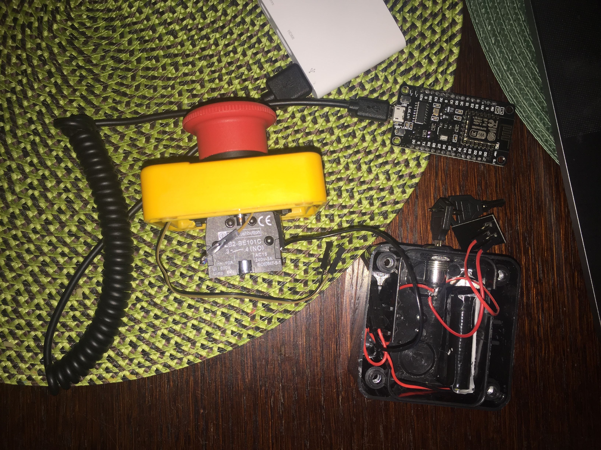

# webhook-button

## Overview
The goal is to create a button that when pushed calls a configured http(s) url.
The idea, hardware setup has developed by my colleague - Aleksander Iwański. 

## How will it work?

The webhook button is powered up by a battery. When the webhook button is powered up WiFi is enabled. 
The button exposes following services:
- /wifi
   
   a html service that allows configuration of wifi connection to an access point.
- [GET] /webhook

    return current configuration of http(s) url address that is called when the button is pushed
    
- [POST] /webhook

    {
        url: `url address to be called`
        headers: [] `array of headers that are passed along the request`
        method: `valid http method like GET, POST, PUT, ...`
        payload: `a string that represents payload`
    } 

When the webhook button is pushed then it calls the configured url accordingly to the configuration

# Setup

* Software
    * [platformio](https://platformio.org)
    * [CLion](https://www.jetbrains.com/clion/)
* Hardware
    * Arduino NodeMCU v3 (used to ease development of targeted ESP8266)
    * ESP8266
    

   
## Preparation of the environment

1. Install platformio
   
    `brew install platformio`

1. Prepare project's dir

    Create project's directory and within the directory execute command:
    `platformio init --ide clion --board nodemcuv2` 

1. Compile project

    `platformio run`
    
1. Connect arduino to computer with USB port
1. Upload program

    `platformio run --target upload`
1. [Optional] reset arduino (stop blinking)
    
    Set `constant WORKING_PROGRAM   = false;`
    compile by `platformio run` and upload `platformio run --target upload`
